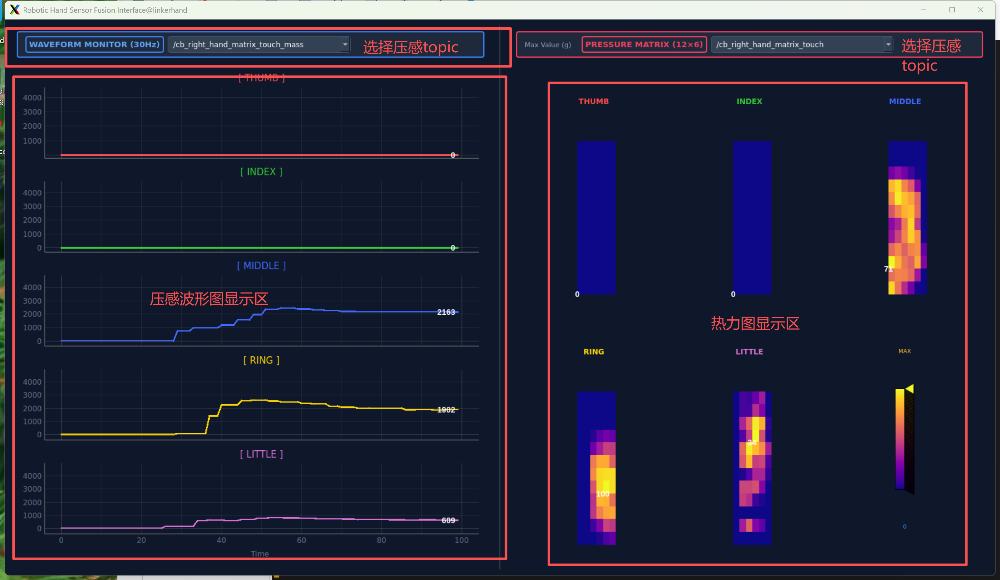

# LinkerHand Dexterous Hand ROS2 SDK

## Overview
The LinkerHand Dexterous Hand ROS SDK is driver software and functional example source code developed by LinkerHand (Beijing) Technology Co., Ltd. for LinkerHand dexterous hands such as O6, L6, L7, O7, L10, L20, G20, and L21. It can be used with both real hardware and simulators.
The LinkerHand ROS2 SDK currently supports Ubuntu 22.04, ROS Humble, Python 3.10 and above.


| Name | Version | Link |
| --- | --- | --- |
| Python SDK |     | [](https://github.com/linker-bot/linkerhand-python-sdk) |
| ROS SDK |     | [](https://github.com/linker-bot/linkerhand-ros-sdk) |
| ROS2 SDK |      | [](https://github.com/linker-bot/linkerhand-ros2-sdk) |

## Installation
&ensp;&ensp;Make sure the current system environment is Ubuntu 20.04, ROS 2 Foxy, Python 3.8.20 or above.
- Download

```bash
  $ mkdir -p linker_hand_ros2_sdk/src
  $ cd linker_hand_ros2_sdk/src
  $ git clone https://github.com/linker-bot/linkerhand-ros2-sdk.git
```

- Build

```bash
  $ sudo apt install python3-can
  $ sudo apt-get install python3-pyqtgraph
  $ cd linker_hand_ros2_sdk/src/
  # On Windows, python-can-candle is required to support the candle protocol of transparent CAN devices
  $ pip install python-can
  $ pip install python-can-candle
  $ pip install -r requirements.txt
```

## Usage for Ubuntu
&ensp;&ensp; __Before use, please modify the [setting.yaml](https://github.com/linker-bot/linkerhand-ros2-sdk/blob/main/linker_hand_ros2_sdk/linker_hand_ros2_sdk/LinkerHand/config/setting.yaml) configuration file according to your actual needs.__
- Modify the password in the setting.yaml configuration file. The default PASSWORD is "12345678".
The default password is the password of the Ubuntu system, which the SDK uses to enable the CAN port automatically.

&ensp;&ensp; __Before use, please configure the single-hand [linker_hand.launch.py](https://github.com/linker-bot/linkerhand-ros2-sdk/blob/main/linker_hand_ros2_sdk/launch/linker_hand.launch.py) or dual-hand [linker_hand_double.launch.py](https://github.com/linker-bot/linkerhand-ros2-sdk/blob/main/linker_hand_ros2_sdk/launch/linker_hand_double.launch.py) file according to the actual parameters of your dexterous hand.__

- Start the SDK for a single hand&ensp;&ensp;&ensp;&ensp;Plug the USB-to-CAN device of the linker_hand dexterous hand into the Ubuntu machine. Supported models: O6/L6/L7/L10/L20/G20/L21/L25
- Start the SDK for dual hands&ensp;&ensp;&ensp;&ensp;First plug the USB-to-CAN device of the left linker_hand dexterous hand into the Ubuntu machine; it is usually recognized as can0. Then plug in the USB-to-CAN device of the right linker_hand dexterous hand; it is usually recognized as can1. Supported models: O6/L6/L7/L10/L20/G20/L21/L25
```bash
  # Enable the CAN port
  $ sudo /usr/sbin/ip link set can0 up type can bitrate 1000000 # The blue LED on the USB-to-CAN device stays on
  $ cd linker_hand_ros2_sdk/
  $ colcon build --symlink-install
  $ source ./install/setup.bash
  $ sudo chmod a+x src/linker_hand_ros2_sdk/linker_hand_ros2_sdk/linker_hand_ros2_sdk/linker_hand.py
  $ # Single hand
  $ ros2 launch linker_hand_ros2_sdk linker_hand.launch.py
  $ # Dual hands
  $ ros2 launch linker_hand_ros2_sdk linker_hand_double.launch.py
  $ [linker_hand_sdk-1] 2025-06-24 17:21:14  Current SDK version: 2.1.4
  $ [linker_hand_sdk-1] 2025-06-24 17:21:14  left L10 set speed to [200, 250, 250, 250, 250, 250, 250, 250, 250, 250]
  $ [linker_hand_sdk-1] 2025-06-24 17:21:14  left L10 set maximum torque to [200, 200, 200, 200, 200]
```

 - How to start the L20 V10 (G20) full-palm pressure-sensing version
 ```bash
  # Enable the CAN port
  $ sudo /usr/sbin/ip link set can0 up type can bitrate 1000000 # The blue LED on the USB-to-CAN device stays on
  $ cd linker_hand_ros2_sdk/
  $ colcon build --symlink-install
  $ source ./install/setup.bash
  # Argument description: --hand_type left or right hand  --can CAN port number  --is_touch whether to enable pressure sensing
  $  ros2 run linker_hand_ros2_sdk linker_hand_g20_palm_touch --hand_type left --can can0 --is_touch true
 ```

## Usage for WIN + ROS2

&ensp;&ensp; __Before use, please configure the [linker_hand.launch.py](https://github.com/linker-bot/linkerhand-ros2-sdk/blob/main/linker_hand_ros2_sdk/launch/linker_hand.launch.py) file according to the actual parameters of your dexterous hand.__

- Start the SDK&ensp;&ensp;&ensp;&ensp;Plug the USB-to-CAN device of the linker_hand dexterous hand into the Windows machine. Supported models: L7/L10/L20/L21/L25
- Note: it can only be used after the USB-to-CAN driver has been installed.
```bash
  $ mkdir -p linker_hand_ros2_sdk/src
  $ cd linker_hand_ros2_sdk/src
  $ git clone https://github.com/linker-bot/linkerhand-ros2-sdk.git
  $ cd linker_hand_ros2_sdk/
  $ set PYTHONUTF8=1 # Set the environment variable to UTF-8 encoding
  $ colcon build --symlink-install
  $ call ./install/local_setup.bat
  $ ros2 launch linker_hand_ros2_sdk linker_hand.launch.py # Modify the CAN port name in the launch configuration file first
  $ [linker_hand_sdk-1] 2025-06-24 17:21:14  Current SDK version: 2.1.4
  $ [linker_hand_sdk-1] 2025-06-24 17:21:14  left L10 set speed to [200, 250, 250, 250, 250, 250, 250, 250, 250, 250]
  $ [linker_hand_sdk-1] 2025-06-24 17:21:14  left L10 set maximum torque to [200, 200, 200, 200, 200]
```

## RS485 Protocol Switching — currently supports O6/L6/L7/L10. For other models, refer to the MODBUS RS485 protocol documentation

Edit the config/setting.yaml configuration file and modify the parameters according to the comments inside it: set MODBUS to "/dev/ttyUSB0", and set the "modbus" parameter in [linker_hand.launch.py](https://github.com/linker-bot/linkerhand-ros2-sdk/blob/main/linker_hand_ros2_sdk/launch/linker_hand.launch.py) to "/dev/ttyUSB0". On Ubuntu, a USB-RS485 converter usually appears as /dev/ttyUSB* or /dev/ttyACM*.
modbus: "None" or "/dev/ttyUSB0"
```bash
# Make sure the dependencies in requirements.txt are installed
# Install the system-level drivers
$ pip install minimalmodbus --break-system-packages
$ pip install pyserial --break-system-packages
$ pip install pymodbus==3.5.1 --break-system-packages
# Check the USB-RS485 port name
$ ls /dev
# Once you see a port such as ttyUSB0, grant it execute permission
$ sudo chmod 777 /dev/ttyUSB0
```

- Mapping table between position and finger joints
```bash
$ ros2 topic echo /cb_left_hand_control_cmd --flow-style
```
```bash
  header: 
    seq: 256
    stamp: 
      secs: 1744343699
      nsecs: 232647418
    frame_id: ''
  name: []
  position: [155.0, 162.0, 176.0, 125.0, 255.0, 255.0, 180.0, 179.0, 181.0, 68.0]
  velocity: [0.0, 0.0, 0.0, 0.0, 0.0, 0.0, 0.0, 0.0, 0.0, 0.0]
  effort: [0.0, 0.0, 0.0, 0.0, 0.0, 0.0, 0.0, 0.0, 0.0, 0.0]
```
- Mapping table between state and finger joints
```bash
$ ros2 topic echo /cb_left_hand_state --flow-style
---
header:
  stamp:
    sec: 1760593389
    nanosec: 128827739
  frame_id: ''
name: []
position: [200.0, 255.0, 254.0, 254.0, 254.0, 180.0]
velocity: [0.0, 0.0, 0.0, 0.0, 0.0, 0.0]
effort: [0.0, 0.0, 0.0, 0.0, 0.0, 0.0]
---
```
  O6:  ["Thumb Flex", "Thumb Abduction", "Index Flex", "Middle Flex", "Ring Flex", "Little Flex"]

  L6:  ["Thumb Flex", "Thumb Abduction", "Index Flex", "Middle Flex", "Ring Flex", "Little Flex"]

  L7:  ["Thumb Flex", "Thumb Abduction", "Index Flex", "Middle Flex", "Ring Flex", "Little Flex", "Thumb Roll"]

  L10: ["Thumb CMC Pitch", "Thumb Abduction", "Index MCP Pitch", "Middle MCP Pitch", "Ring MCP Pitch", "Little MCP Pitch", "Index Abduction", "Ring Abduction", "Little Abduction", "Thumb Roll"]

  L20: ["Thumb Base", "Index Base", "Middle Base", "Ring Base", "Little Base", "Thumb Abduction", "Index Abduction", "Middle Abduction", "Ring Abduction", "Little Abduction", "Thumb Roll", "Reserved", "Reserved", "Reserved", "Reserved", "Thumb Tip", "Index Tip", "Middle Tip", "Ring Tip", "Little Tip"]

  G20 (Industrial Version): ["Thumb Base", "Index Base", "Middle Base", "Ring Base", "Little Base", "Thumb Abduction", "Index Abduction", "Middle Abduction", "Ring Abduction", "Little Abduction", "Thumb Roll", "Reserved", "Reserved", "Reserved", "Reserved", "Thumb Tip", "Index Tip", "Middle Tip", "Ring Tip", "Little Tip"]

  L21: ["Thumb Base","Index Base","Middle Base","Ring Base","Little Base","Thumb Abduction","Index Abduction","Middle Abduction","Ring Abduction","Little Abduction","Thumb Roll","Reserved","Reserved","Reserved","Reserved","Thumb Middle","Reserved","Reserved","Reserved","Reserved","Thumb Tip","Index Tip","Middle Tip","Ring Tip","Little Tip"]

  L25: ["Thumb Base", "Index Base", "Middle Base","Ring Base","Little Base","Thumb Abduction","Index Abduction","Middle Abduction","Ring Abduction","Little Abduction","Thumb Roll","Reserved","Reserved","Reserved","Reserved","Thumb Middle","Index Middle","Middle Middle","Ring Middle","Little Middle","Thumb Tip","Index Tip","Middle Tip","Ring Tip","Little Tip"]

## Version Updates
- > ### release_3.0.1
 - 1. Added RS485 (pymodbus mode) communication support for O6/L6/L10
 - 2. Refactored the ROS2 logic layer to improve CAN communication efficiency

- > ### release_2.2.4
 - 1. Added CAN communication support for the G20 industrial-version dexterous hand

- > ### release_2.2.3
 - 1. Added real-time speed and torque control to the GUI

- > ### release_2.2.1
 - 1. Added the dot-matrix heatmap for the matrix pressure sensor
 - 2. Added O6 RS485 communication

- > ### release_2.1.9
 - 1. Added support for the O6/L6 dexterous hands

- > ### release_2.1.8
 - 1. Fixed an occasional frame collision issue

 - ...................


## [Examples](examples/)

&ensp;&ensp; __Before use, please modify the [setting.yaml](https://github.com/linker-bot/linkerhand-ros2-sdk/blob/main/linker_hand_ros2_sdk/linker_hand_ros2_sdk/LinkerHand/config/setting.yaml) configuration file according to your actual needs.__


## [Example] General
- **gui_control (GUI control and action examples)**
The GUI lets you move each joint of the LinkerHand L10 and L20 dexterous hands independently with sliders. You can also use the add button to record the current values of all sliders, saving the present motion state of every joint of the LinkerHand, and then replay those actions with the function buttons.

Controlling the LinkerHand with gui_control:
gui_control operates the dexterous hand through topics, so linker_hand_sdk_ros must be running first.
After starting the ROS2 SDK:

&ensp;&ensp; __Before use, please configure the [gui_control.launch.py](https://github.com/linker-bot/linkerhand-ros2-sdk/blob/main/gui_control/launch/gui_control.launch.py) file according to the actual parameters of your dexterous hand.__


```bash
# Open a new terminal
$ cd linker_hand_ros2_sdk/
$ source ./install/setup.bash
$ ros2 launch gui_control gui_control.launch.py
```
A UI window pops up once started. The sliders control the movement of the corresponding LinkerHand joints.

- Adding or modifying action examples. Actions can be added or modified in [constants.py](https://github.com/linker-bot/linkerhand-ros2-sdk/blob/main/gui_control/gui_control/config/constants.py).
```python
# For example, adding an action sequence for the L6
"L6": HandConfig(
        joint_names_en=["thumb_cmc_pitch", "thumb_cmc_yaw", "index_mcp_pitch", "middle_mcp_pitch", "pinky_mcp_pitch", "ring_mcp_pitch"],
        joint_names=["大拇指弯曲", "大拇指横摆", "食指弯曲", "中指弯曲", "无名指弯曲", "小拇指弯曲"],
        init_pos=[250] * 6,
        preset_actions={
            "张开": [250, 250, 250, 250, 250, 250],
            "壹": [0, 31, 255, 0, 0, 0],
            "贰": [0, 31, 255, 255, 0, 0],
            "叁": [0, 30, 255, 255, 255, 0], 
            "肆": [0, 30, 255, 255, 255, 255],
            "伍": [250, 250, 250, 250, 250, 250],
            "OK": [54, 41, 164, 250, 250, 250],
            "点赞": [255, 31, 0, 0, 0, 0],
            "握拳": [49, 61, 0, 0, 0, 0],
            # Add your own custom actions......
        }
    )
```

## [Example] pressure_diagram (matrix pressure waveform and heatmap)
 - Note: gui_control starts pressure_diagram — the matrix pressure waveform and heatmap — by default.
The matrix pressure heatmap displays the fingertip matrix pressure sensor data of each joint of the LinkerHand dexterous hand as waveforms and heatmaps. It can only be used after you have confirmed that the dexterous hand is equipped with matrix pressure sensors.
After starting the ROS2 SDK:




```bash
# After the SDK of a Linker Hand equipped with matrix pressure sensors has started successfully
# Open a new terminal
$ cd linker_hand_ros2_sdk/
$ source ./install/setup.bash
$ ros2 launch pressure_diagram pressure_diagram.launch.py
```

## Using the GUI in a WIN + ROS2 Environment
&ensp;&ensp; __Before use, please configure the [gui_control.launch.py](https://github.com/linker-bot/linkerhand-ros2-sdk/blob/main/gui_control/launch/gui_control.launch.py) file according to the actual parameters of your dexterous hand.__
```bash
# Open a new terminal
$ cd linker_hand_ros2_sdk/
$ call ./install/setup.bash
$ ros2 launch gui_control gui_control.launch.py
```

## L7
- [7001-action-group-show-ti (finger movement)](https://github.com/linker-bot/linkerhand-ros2-sdk/blob/main/examples/L7/gesture/action-group-show-ti.py)

## L10
- [10001-action-group-show-normal (finger movement)](https://github.com/linker-bot/linkerhand-ros2-sdk/blob/main/examples/L10/gesture/action-group-show-normal.py)


## Topic Document
[Linker Hand Topic Document](doc/Topic-Reference.md)

## Mujoco and PyBullet Simulation
 - [Mujoco and PyBullet repository](https://github.com/linker-bot/linkerhand-sim)


## Advanced Usage — supports O6 / L6 / L7 / G20
 - If all you need is to send commands, read state, and read pressure-sensing data, you can use the advanced usage below. It is generally used for data collection.
```bash
# '/cb_{self.hand_type}_hand_control_cmd' control topic, type sensor_msgs/msg/JointState, limited to 30Hz
# '/cb_{self.hand_type}_hand_state' topic, type sensor_msgs/msg/JointState, 40Hz or above
# '/cb_{self.hand_type}_hand_matrix_touch' topic, type std_msgs/msg/String, 40Hz or above
# '/cb_{self.hand_type}_hand_matrix_touch_pc' topic, type sensor_msgs/msg/PointCloud2, 40Hz or above, publishes the matrix pressure data in point cloud format
# '/cb_{self.hand_type}_hand_matrix_touch_mass' topic, type std_msgs/msg/String, 40Hz or above
# Using the O6 as an example
$ cd linker_hand_ros2_sdk/
$ colcon build --symlink-install
$ source ./install/setup.bash
$ sudo /usr/sbin/ip link set can0 up type can bitrate 1000000 # The blue LED on the USB-to-CAN device stays on; do this after modifying setting.yaml as required
$ ros2 run linker_hand_ros2_sdk linker_hand_advanced_o6 --hand_type left --can can0 --is_touch true
# How to start other dexterous hand models
# L6 right hand, without fingertip pressure sensing
$ ros2 run linker_hand_ros2_sdk linker_hand_advanced_l6 --hand_type right --can can0 --is_touch false
# L7 left hand, with fingertip pressure sensing
$ ros2 run linker_hand_ros2_sdk linker_hand_advanced_l7 --hand_type left --can can0 --is_touch true
# G20 left hand, with fingertip pressure sensing
$ ros2 run linker_hand_ros2_sdk linker_hand_advanced_g20 --hand_type left --can can0 --is_touch true
```
 - Advanced usage, dual-hand control — supports O6 / L6 / L7 / G20

Open terminal 1
```bash
# Using the O6 as an example
$ cd linker_hand_ros2_sdk/
$ colcon build --symlink-install
$ source ./install/setup.bash
$ sudo /usr/sbin/ip link set can0 up type can bitrate 1000000 # The blue LED on the USB-to-CAN device stays on; do this after modifying setting.yaml as required
$ ros2 run linker_hand_ros2_sdk linker_hand_advanced_o6 --hand_type left --can can0 --is_touch true # Start the left hand, with pressure sensing
```
Open terminal 2
```bash
# Using the O6 as an example
$ cd linker_hand_ros2_sdk/
$ source ./install/setup.bash
$ sudo /usr/sbin/ip link set can1 up type can bitrate 1000000 # The blue LED on the USB-to-CAN device stays on
$ ros2 run linker_hand_ros2_sdk linker_hand_advanced_o6 --hand_type right --can can1 --is_touch false # Start the right hand, without pressure sensing
```
