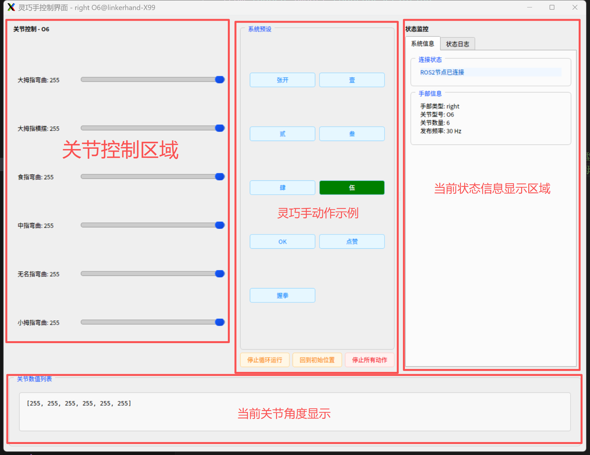

# LinkerHand Dexterous Hand ROS2 SDK

## Overview
The LinkerHand Dexterous Hand ROS SDK is driver software and functional example source code developed by LinkerHand (Beijing) Technology Co., Ltd. for LinkerHand dexterous hands such as O6, L6, L7, O7, L10, L20, G20, and L21. It can be used with both real hardware and simulators. The LinkerHand ROS2 SDK currently supports Ubuntu 22.04, ROS Humble, Python 3.10 and above environments.


| Name | Version | Link |
| --- | --- | --- |
| Python SDK |     | [](https://github.com/linker-bot/linkerhand-python-sdk) |
| ROS SDK |     | [](https://github.com/linker-bot/linkerhand-ros-sdk) |
| ROS2 SDK |      | [](https://github.com/linker-bot/linkerhand-ros2-sdk) |

## Installation
&ensp;&ensp;Ensure your current system environment is Ubuntu 20.04, ROS 2 Foxy, Python 3.8.20 or above.
- Download

```bash
  $ mkdir -p linker_hand_ros2_sdk/src
  $ cd linker_hand_ros2_sdk/src
  $ git clone https://github.com/linker-bot/linkerhand-ros2-sdk.git
```

- Build

```bash
  $ sudo apt install python3-can
  $ cd linker_hand_ros2_sdk/src/
  $ pip install -r requirements.txt
```

## Usage for Ubuntu
&ensp;&ensp; __Before use, please modify the [setting.yaml](https://github.com/linker-bot/linkerhand-ros2-sdk/blob/main/linker_hand_ros2_sdk/linker_hand_ros2_sdk/LinkerHand/config/setting.yaml) configuration file according to your actual needs.__
- Modify the password in the ```setting.yaml``` configuration file. Default ```PASSWORD: "12345678"``` The default password is the Ubuntu system password, which the SDK uses to automatically enable the CAN port.

&ensp;&ensp; __Before use, please configure the single-hand[linker_hand.launch.py](https://github.com/linker-bot/linkerhand-ros2-sdk/blob/main/linker_hand_ros2_sdk/launch/linker_hand.launch.py) or dual-hand[linker_hand_double.launch.py](https://github.com/linker-bot/linkerhand-ros2-sdk/blob/main/linker_hand_ros2_sdk/launch/linker_hand_double.launch.py)files according to the actual dexterous hand parameters.__

- Start SDK for Single Hand&ensp;&ensp;&ensp;&ensp;Plug the linker_hand dexterous hand's USB-to-CAN device into the Ubuntu device. Supported models: O6/L6/L7/L10/L20/G20/L21/L25.
- Start SDK for Dual Hands&ensp;&ensp;&ensp;&ensp;First, plug the left linker_hand's USB-to-CAN device into the Ubuntu device (usually recognized as can0). Then, plug the right linker_hand's USB-to-CAN device into the Ubuntu device (usually recognized as can1). Supported models: O6/L6/L7/L10/L20/G20/L21/L25.
```bash
  # Enable CAN port
  $ sudo /usr/sbin/ip link set can0 up type can bitrate 1000000 # USB-to-CAN device should have a solid blue light
  $ cd linker_hand_ros2_sdk/
  $ colcon build --symlink-install
  $ source ./install/setup.bash
  $ sudo chmod a+x src/linker_hand_ros2_sdk/linker_hand_ros2_sdk/linker_hand_ros2_sdk/linker_hand.py
  $ # Single Hand
  $ ros2 launch linker_hand_ros2_sdk linker_hand.launch.py
  $ # Dual Hands
  $ ros2 launch linker_hand_ros2_sdk linker_hand_double.launch.py
  $ [linker_hand_sdk-1] 2025-06-24 17:21:14  Current SDK version: 2.1.4
  $ [linker_hand_sdk-1] 2025-06-24 17:21:14  left L10 set speed to [200, 250, 250, 250, 250, 250, 250, 250, 250, 250]
  $ [linker_hand_sdk-1] 2025-06-24 17:21:14  left L10 set maximum torque to [200, 200, 200, 200, 200]
```

## Usage for WIN + ROS2

&ensp;&ensp; __Before use, please configure the [linker_hand.launch.py](https://github.com/linker-bot/linkerhand-ros2-sdk/blob/main/linker_hand_ros2_sdk/launch/linker_hand.launch.py) file according to the actual dexterous hand parameters.__

- Start SDK&ensp;&ensp;&ensp;&ensp;Plug the linker_hand dexterous hand's USB-to-CAN device into the Windows system device. Supported models: L7/L10/L20/L21/L25.
- Note: Requires the USB-to-CAN driver to be installed.
```bash
  $ mkdir -p linker_hand_ros2_sdk/src
  $ cd linker_hand_ros2_sdk/src
  $ git clone https://github.com/linker-bot/linkerhand-ros2-sdk.git
  $ cd linker_hand_ros2_sdk/
  $ set PYTHONUTF8=1 # Set environment variable to UTF-8 encoding
  $ colcon build --symlink-install
  $ call ./install/local_setup.bat
  $ ros2 launch linker_hand_ros2_sdk linker_hand.launch.py # Modify the CAN port name in the launch config first
  $ [linker_hand_sdk-1] 2025-06-24 17:21:14  Current SDK version: 2.1.4
  $ [linker_hand_sdk-1] 2025-06-24 17:21:14  left L10 set speed to [200, 250, 250, 250, 250, 250, 250, 250, 250, 250]
  $ [linker_hand_sdk-1] 2025-06-24 17:21:14  left L10 set maximum torque to [200, 200, 200, 200, 200]
```

## RS485 Protocol Switching (Currently supports O6/L6/L10, refer to the MODBUS RS485 protocol document for other models)

Edit the config/setting.yaml configuration file and modify parameters according to the comments. Set MODBUS:"/dev/ttyUSB0", and set the "modbus" parameter in the linker_hand.launch.py file to "/dev/ttyUSB0". The USB-RS485 converter is usually displayed as /dev/ttyUSB* or /dev/ttyACM* on Ubuntu. 
modbus: "None" or "/dev/ttyUSB0"
```bash
# Ensure dependencies in requirements.txt are installed
# Install system-level drivers
$ pip install minimalmodbus --break-system-packages
$ pip install pyserial --break-system-packages
$ pip install pymodbus==3.5.1 --break-system-packages
# Check USB-RS485 port name
$ ls /dev
# You should see a port like ttyUSB0, then grant permissions
$ sudo chmod 777 /dev/ttyUSB0
```

- Position and Finger Joint Mapping Table
```bash
$ ros2 topic echo /cb_left_hand_control_cmd --flow-style
```
```bash
  header: 
    seq: 256
    stamp: 
      secs: 1744343699
      nsecs: 232647418
    frame_id: ''
  name: []
  position: [155.0, 162.0, 176.0, 125.0, 255.0, 255.0, 180.0, 179.0, 181.0, 68.0]
  velocity: [0.0, 0.0, 0.0, 0.0, 0.0, 0.0, 0.0, 0.0, 0.0, 0.0]
  effort: [0.0, 0.0, 0.0, 0.0, 0.0, 0.0, 0.0, 0.0, 0.0, 0.0]
```
- State and Finger Joint Mapping Table
```bash
$ ros2 topic echo /cb_left_hand_state --flow-style
---
header:
  stamp:
    sec: 1760593389
    nanosec: 128827739
  frame_id: ''
name: []
position: [200.0, 255.0, 254.0, 254.0, 254.0, 180.0]
velocity: [0.0, 0.0, 0.0, 0.0, 0.0, 0.0]
effort: [0.0, 0.0, 0.0, 0.0, 0.0, 0.0]
---
```
  O6:  ["Thumb Flex", "Thumb Abduction", "Index Flex", "Middle Flex", "Ring Flex", "Little Flex"]

  L6:  ["Thumb Flex", "Thumb Abduction", "Index Flex", "Middle Flex", "Ring Flex", "Little Flex"]

  L7:  ["Thumb Flex", "Thumb Abduction", "Index Flex", "Middle Flex", "Ring Flex", "Little Flex", "Thumb Roll"]

  L10: ["Thumb CMC Pitch", "Thumb Abduction", "Index MCP Pitch", "Middle MCP Pitch", "Ring MCP Pitch", "Little MCP Pitch", "Index Abduction", "Ring Abduction", "Little Abduction", "Thumb Roll"]

  L20: ["Thumb Base", "Index Base", "Middle Base", "Ring Base", "Little Base", "Thumb Abduction", "Index Abduction", "Middle Abduction", "Ring Abduction", "Little Abduction", "Thumb Roll", "Reserved", "Reserved", "Reserved", "Reserved", "Thumb Tip", "Index Tip", "Middle Tip", "Ring Tip", "Little Tip"]

  G20 (Industrial Version): ["Thumb Base", "Index Base", "Middle Base", "Ring Base", "Little Base", "Thumb Abduction", "Index Abduction", "Middle Abduction", "Ring Abduction", "Little Abduction", "Thumb Roll", "Reserved", "Reserved", "Reserved", "Reserved", "Thumb Tip", "Index Tip", "Middle Tip", "Ring Tip", "Little Tip"]

  L21: ["Thumb Base","Index Base","Middle Base","Ring Base","Little Base","Thumb Abduction","Index Abduction","Middle Abduction","Ring Abduction","Little Abduction","Thumb Roll","Reserved","Reserved","Reserved","Reserved","Thumb Middle","Reserved","Reserved","Reserved","Reserved","Thumb Tip","Index Tip","Middle Tip","Ring Tip","Little Tip"]

  L25: ["Thumb Base", "Index Base", "Middle Base","Ring Base","Little Base","Thumb Abduction","Index Abduction","Middle Abduction","Ring Abduction","Little Abduction","Thumb Roll","Reserved","Reserved","Reserved","Reserved","Thumb Middle","Index Middle","Middle Middle","Ring Middle","Little Middle","Thumb Tip","Index Tip","Middle Tip","Ring Tip","Little Tip"]

## Version Updates
- > ### release_3.0.1
 - 1、Support O6/L6/L10 RS485 communication in pymodbus mode.
 - 2、Refactored ROS2 logic layer to improve CAN communication efficiency.

- > ### release_2.2.4
 - 1、Added support for G20 Industrial Version dexterous hand CAN communication.

- > ### release_2.2.3
 - 1、Added real-time speed and torque control to the GUI control.

- > ### release_2.2.1
 - 1、Added matrix pressure sensor heatmap visualization.
 - 2、Added O6 RS485 communication support.

- > ### release_2.1.9
 - 1、Supported O6/L6 version dexterous hands.

- > ### release_2.1.8
 - 1、Fixed occasional frame collision issues.

 - ...................


## [Examples](examples/)

&ensp;&ensp; __Before use, please modify the [setting.yaml](https://github.com/linker-bot/linkerhand-ros2-sdk/blob/main/linker_hand_ros2_sdk/linker_hand_ros2_sdk/LinkerHand/config/setting.yaml) configuration file according to your actual needs.__


## [Example]General
- [gui_control(GUI Control and Action Examples)](GUI Control and Action Examples)
he GUI control allows independent movement of each joint of the LinkerHand L10 and L20 dexterous hands via sliders. You can also record the current values of all sliders using the add button to save the current joint state of the LinkerHand. Functional buttons can be used to replay actions.  

Using gui_control to control the LinkerHand: The gui_control interface requires the linker_hand_sdk_ros to be running, as it operates on the LinkerHand via ROS topics. After starting the ROS2 SDK,

&ensp;&ensp; __Before use, please configure the [gui_control.launch.py](https://github.com/linker-bot/linkerhand-ros2-sdk/blob/main/gui_control/launch/gui_control.launch.py)file according to the actual dexterous hand parameters.__



```bash
# Open a new terminal
$ cd linker_hand_ros2_sdk/
$ source ./install/setup.bash
$ ros2 launch gui_control gui_control.launch.py
```
A UI window will pop up. The sliders can be used to control the corresponding LinkerHand joint movements.

- Add or modify action examples. You can add or modify actions in the[constants.py](https://github.com/linker-bot/linkerhand-ros2-sdk/blob/main/gui_control/gui_control/config/constants.py)file.
```python
# For example, adding action sequences for L6
"L6": HandConfig(
        joint_names_en=["thumb_cmc_pitch", "thumb_cmc_yaw", "index_mcp_pitch", "middle_mcp_pitch", "pinky_mcp_pitch", "ring_mcp_pitch"],
        joint_names=["大拇指弯曲", "大拇指横摆", "食指弯曲", "中指弯曲", "无名指弯曲", "小拇指弯曲"],
        init_pos=[250] * 6,
        preset_actions={
            "张开": [250, 250, 250, 250, 250, 250],
            "壹": [0, 31, 255, 0, 0, 0],
            "贰": [0, 31, 255, 255, 0, 0],
            "叁": [0, 30, 255, 255, 255, 0], 
            "肆": [0, 30, 255, 255, 255, 255],
            "伍": [250, 250, 250, 250, 250, 250],
            "OK": [54, 41, 164, 250, 250, 250],
            "点赞": [255, 31, 0, 0, 0, 0],
            "握拳": [49, 61, 0, 0, 0, 0],
            # Add custom actions......
        }
    )
```

## [Example] [matrix_touch_gui (Matrix Pressure Sensor Heatmap)]
The matrix pressure sensor heatmap displays the fingertip matrix pressure sensor data for each joint of the LinkerHand dexterous hand in the form of a heatmap. This can only be used if the dexterous hand is equipped with matrix pressure sensors. After starting the ROS2 SDK
&ensp;&ensp; __Before use, please configure the [matrix_touch_gui.launch.py](https://github.com/linker-bot/linkerhand-ros2-sdk/blob/main/matrix_touch_gui/launch/matrix_touch_gui.launch.py)file according to the actual dexterous hand parameters.__


```bash
# Open a new terminal
$ cd linker_hand_ros2_sdk/
$ source ./install/setup.bash
$ ros2 launch matrix_touch_gui matrix_touch_gui.launch.py
```

## Usage of GUI in WIN + ROS2 Environment
&ensp;&ensp; __Before use, please configure the [gui_control.launch.py](https://github.com/linker-bot/linkerhand-ros2-sdk/blob/main/gui_control/launch/gui_control.launch.py)file according to the actual dexterous hand parameters.__
```bash
# Open a new terminal
$ cd linker_hand_ros2_sdk/
$ call ./install/setup.bash
$ ros2 launch gui_control gui_control.launch.py
```

## L7
- [7001-action-group-show-ti(Finger Movement)](https://github.com/linker-bot/linkerhand-ros2-sdk/blob/main/examples/L7/gesture/action-group-show-ti.py)

## L10
- [10001-action-group-show-normal(Finger Movement)](https://github.com/linker-bot/linkerhand-ros2-sdk/blob/main/examples/L10/gesture/action-group-show-normal.py)


## Topic Document
[Linker Hand Topic Document](doc/Topic-Reference.md)

## Mujoco Pybullet仿真
 - [Mujoco和PyBullet仓库](https://github.com/linker-bot/linkerhand-sim)


