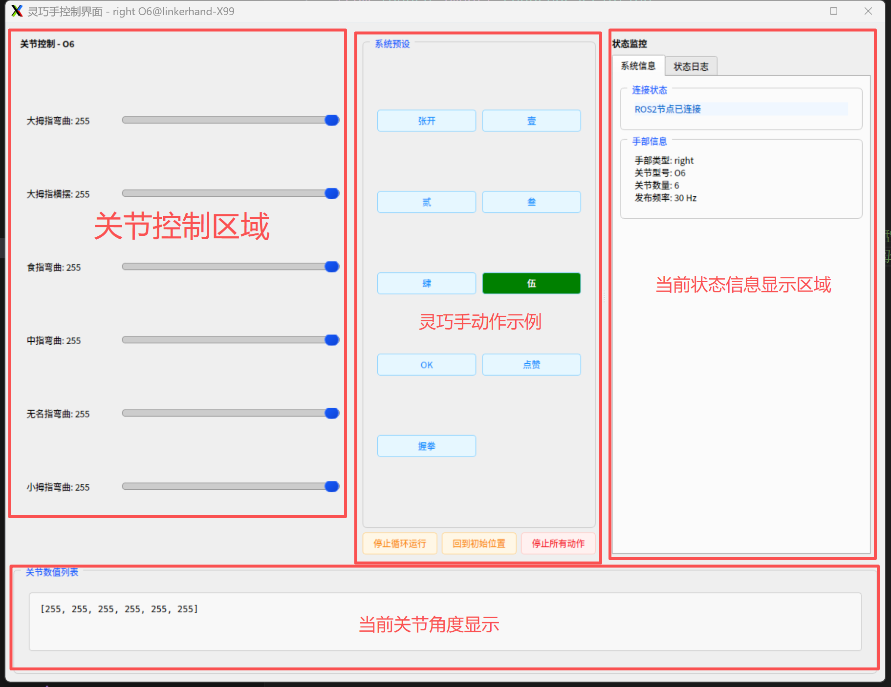
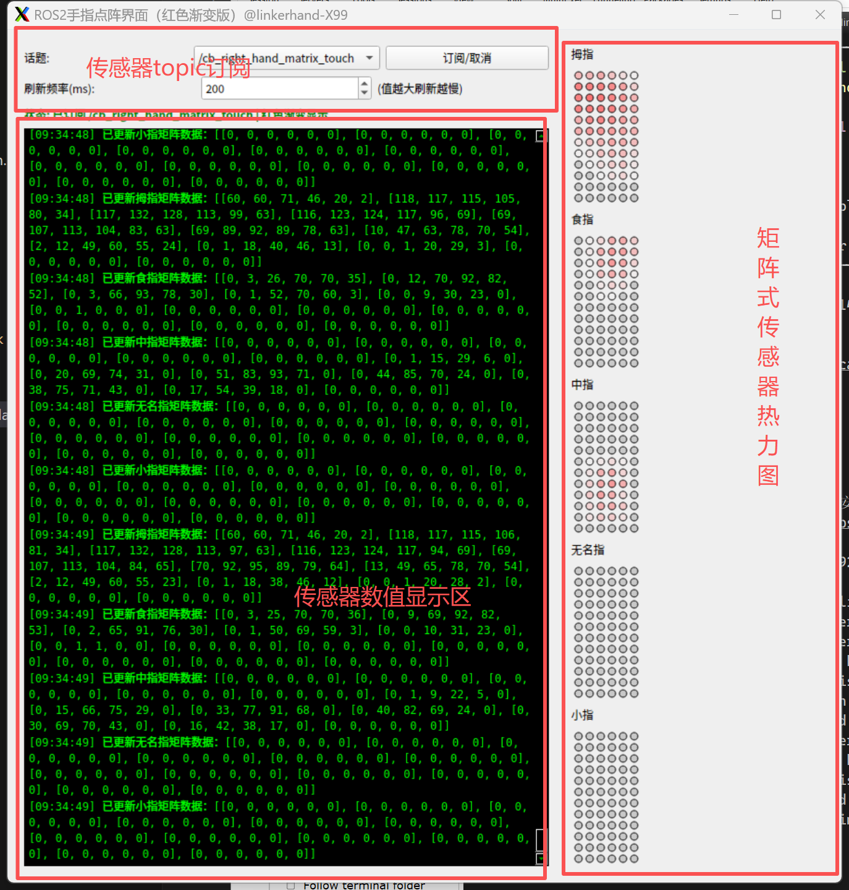

# LinkerHand灵巧手ROS2 SDK

## 概述
LinkerHand灵巧手ROS SDK 是灵心巧手(北京)科技有限公司开发，用于O6、L6、L7、O7、L10、L20、G20、L21等LinkerHand灵巧手的驱动软件和功能示例源码。可用于真机与仿真器使用。
LinkerHandROS2 SDK当前支持Ubuntu22.04 ROS humble Python3.10 及以上环境


| Name | Version | Link |
| --- | --- | --- |
| Python SDK |     | [](https://github.com/linker-bot/linkerhand-python-sdk) |
| ROS SDK |     | [](https://github.com/linker-bot/linkerhand-ros-sdk) |
| ROS2 SDK |      | [](https://github.com/linker-bot/linkerhand-ros2-sdk) |

## 安装
&ensp;&ensp;确保当前系统环境为Ubuntu20.04 ROS 2 Foxy Python3.8.20 及以上
- 下载

```bash
  $ mkdir -p linker_hand_ros2_sdk/src
  $ cd linker_hand_ros2_sdk/src
  $ git clone https://github.com/linker-bot/linkerhand-ros2-sdk.git
```

- 编译

```bash
  $ sudo apt install python3-can
  $ cd linker_hand_ros2_sdk/src/
  # win下需要安装python-can-candle用于适配透明CAN设备candle协议
  $ pip install python-can
  $ pip install python-can-candle
  $ pip install -r requirements.txt
```

## 使用 for Ubuntu
&ensp;&ensp; __使用前请先将 [setting.yaml](https://github.com/linker-bot/linkerhand-ros2-sdk/blob/main/linker_hand_ros2_sdk/linker_hand_ros2_sdk/LinkerHand/config/setting.yaml) 配置文件根据实际需求进行相应修改该.__
- 修改setting.yaml配置文件的密码，默认PASSWORD："12345678" 
默认密码为Ubuntu系统的密码，用户sdk自动开启CAN端口

&ensp;&ensp; __使用前请先将单手[linker_hand.launch.py](https://github.com/linker-bot/linkerhand-ros2-sdk/blob/main/linker_hand_ros2_sdk/launch/linker_hand.launch.py) or 双手[linker_hand_double.launch.py](https://github.com/linker-bot/linkerhand-ros2-sdk/blob/main/linker_hand_ros2_sdk/launch/linker_hand_double.launch.py)文件按照实际灵巧手参数进行配置.__

- 启动SDK单手&ensp;&ensp;&ensp;&ensp;将linker_hand灵巧手的USB转CAN设备插入Ubuntu设备上  支持型号:O6/L6/L7/L10/L20/G20/L21/L25
- 启动SDK双手&ensp;&ensp;&ensp;&ensp;先将左手linker_hand灵巧手的USB转CAN设备插入Ubuntu设备上，一般被识别为can0。再将右手linker_hand灵巧手的USB转CAN设备插入Ubuntu设备上，一般识别为can1.  支持型号:O6/L6/L7/L10/L20/G20/L21/L25
```bash
  # 开启CAN端口
  $ sudo /usr/sbin/ip link set can0 up type can bitrate 1000000 #USB转CAN设备蓝色灯常亮状态
  $ cd linker_hand_ros2_sdk/
  $ colcon build --symlink-install
  $ source ./install/setup.bash
  $ sudo chmod a+x src/linker_hand_ros2_sdk/linker_hand_ros2_sdk/linker_hand_ros2_sdk/linker_hand.py
  $ # 单手
  $ ros2 launch linker_hand_ros2_sdk linker_hand.launch.py
  $ # 双手
  $ ros2 launch linker_hand_ros2_sdk linker_hand_double.launch.py
  $ [linker_hand_sdk-1] 2025-06-24 17:21:14  Current SDK version: 2.1.4
  $ [linker_hand_sdk-1] 2025-06-24 17:21:14  left L10 set speed to [200, 250, 250, 250, 250, 250, 250, 250, 250, 250]
  $ [linker_hand_sdk-1] 2025-06-24 17:21:14  left L10 set maximum torque to [200, 200, 200, 200, 200]
```

## 使用 for WIN+ROS2

&ensp;&ensp; __使用前请先将 [linker_hand.launch.py](https://github.com/linker-bot/linkerhand-ros2-sdk/blob/main/linker_hand_ros2_sdk/launch/linker_hand.launch.py)文件按照实际灵巧手参数进行配置.__

- 启动SDK&ensp;&ensp;&ensp;&ensp;将linker_hand灵巧手的USB转CAN设备插入WIN系统设备上  支持型号:L7/L10/L20/L21/L25
- 注：安装好USB转CAN驱动后才可使用
```bash
  $ mkdir -p linker_hand_ros2_sdk/src
  $ cd linker_hand_ros2_sdk/src
  $ git clone https://github.com/linker-bot/linkerhand-ros2-sdk.git
  $ cd linker_hand_ros2_sdk/
  $ set PYTHONUTF8=1 # 设置环境变量为UTF-8编码
  $ colcon build --symlink-install
  $ call ./install/local_setup.bat
  $ ros2 launch linker_hand_ros2_sdk linker_hand.launch.py #先修改launch配置文件的CAN端口名称
  $ [linker_hand_sdk-1] 2025-06-24 17:21:14  Current SDK version: 2.1.4
  $ [linker_hand_sdk-1] 2025-06-24 17:21:14  left L10 set speed to [200, 250, 250, 250, 250, 250, 250, 250, 250, 250]
  $ [linker_hand_sdk-1] 2025-06-24 17:21:14  left L10 set maximum torque to [200, 200, 200, 200, 200]
```

## RS485 协议切换 当前支持O6/L6/L10，其他型号灵巧手请参考MODBUS RS485协议文档

编辑config/setting.yaml配置文件，按照配置文件内注释说明进行参数修改,将MODBUS:"/dev/ttyUSB0"，并且[linker_hand.launch.py](https://github.com/linker-bot/linkerhand-ros2-sdk/blob/main/linker_hand_ros2_sdk/launch/linker_hand.launch.py)配置文件中"modbus"参数为"/dev/ttyUSB0"。USB-RS485转换器在Ubuntu上一般显示为/dev/ttyUSB* or /dev/ttyACM*
modbus: "None" or "/dev/ttyUSB0"
```bash
# 确保requirements.txt安装依赖
# 安装系统级相关驱动
$ pip install minimalmodbus --break-system-packages
$ pip install pyserial --break-system-packages
$ pip install pymodbus==3.5.1 --break-system-packages
# 查看USB-RS485端口号
$ ls /dev
# 可以看到类似ttyUSB0端口后给端口执行权限
$ sudo chmod 777 /dev/ttyUSB0
```

- position与手指关节对照表
```bash
$ ros2 topic echo /cb_left_hand_control_cmd --flow-style
```
```bash
  header: 
    seq: 256
    stamp: 
      secs: 1744343699
      nsecs: 232647418
    frame_id: ''
  name: []
  position: [155.0, 162.0, 176.0, 125.0, 255.0, 255.0, 180.0, 179.0, 181.0, 68.0]
  velocity: [0.0, 0.0, 0.0, 0.0, 0.0, 0.0, 0.0, 0.0, 0.0, 0.0]
  effort: [0.0, 0.0, 0.0, 0.0, 0.0, 0.0, 0.0, 0.0, 0.0, 0.0]
```
- state与手指关节对照表
```bash
$ ros2 topic echo /cb_left_hand_state --flow-style
---
header:
  stamp:
    sec: 1760593389
    nanosec: 128827739
  frame_id: ''
name: []
position: [200.0, 255.0, 254.0, 254.0, 254.0, 180.0]
velocity: [0.0, 0.0, 0.0, 0.0, 0.0, 0.0]
effort: [0.0, 0.0, 0.0, 0.0, 0.0, 0.0]
---
```
  O6:  ["大拇指弯曲", "大拇指横摆","食指弯曲", "中指弯曲", "无名指弯曲","小拇指弯曲"]

  L6:  ["大拇指弯曲", "大拇指横摆","食指弯曲", "中指弯曲", "无名指弯曲","小拇指弯曲"]

  L7:  ["大拇指弯曲", "大拇指横摆","食指弯曲", "中指弯曲", "无名指弯曲","小拇指弯曲","拇指旋转"]

  L10: ["拇指根部", "拇指侧摆","食指根部", "中指根部", "无名指根部","小指根部","食指侧摆","无名指侧摆","小指侧摆","拇指旋转"]

  L20: ["拇指根部", "食指根部", "中指根部", "无名指根部","小指根部","拇指侧摆","食指侧摆","中指侧摆","无名指侧摆","小指侧摆","拇指横摆","预留","预留","预留","预留","拇指尖部","食指末端","中指末端","无名指末端","小指末端"]

  G20(工业版): ["拇指根部", "食指根部", "中指根部", "无名指根部","小指根部","拇指侧摆","食指侧摆","中指侧摆","无名指侧摆","小指侧摆","拇指横摆","预留","预留","预留","预留","拇指尖部","食指末端","中指末端","无名指末端","小指末端"]

  L21: ["大拇指根部","食指根部","中指根部","无名指根部","小拇指根部","大拇指侧摆","食指侧摆","中指侧摆","无名指侧摆","小拇指侧摆","大拇指横滚","预留","预留","预留","预留","大拇指中部","预留","预留","预留","预留","大拇指指尖","食指指尖","中指指尖","无名指指尖","小拇指指尖"]

  L25: ["大拇指根部", "食指根部", "中指根部","无名指根部","小拇指根部","大拇指侧摆","食指侧摆","中指侧摆","无名指侧摆","小拇指侧摆","大拇指横滚","预留","预留","预留","预留","大拇指中部","食指中部","中指中部","无名指中部","小拇指中部","大拇指指尖","食指指尖","中指指尖","无名指指尖","小拇指指尖"]

## 版本更新
- > ### release_3.0.1
 - 1、支持O6/L6/L10 RS485通讯 pymodbus模式
 - 2、重构ROS2逻辑层，提升CAN通讯效率

- > ### release_2.2.4
 - 1、新增G20工业版灵巧手CAN通讯支持

- > ### release_2.2.3
 - 1、gui图形控制新增速度、扭矩实时控制

- > ### release_2.2.1
 - 1、新增矩阵式压力传感器点阵热力示意图
 - 2、新增O6 RS485通讯

- > ### release_2.1.9
 - 1、支持O6/L6版本灵巧手

- > ### release_2.1.8
 - 1、修复偶发撞帧问题

 - ...................


## [示例](examples/)

&ensp;&ensp; __使用前请先将 [setting.yaml](https://github.com/linker-bot/linkerhand-ros2-sdk/blob/main/linker_hand_ros2_sdk/linker_hand_ros2_sdk/LinkerHand/config/setting.yaml) 配置文件根据实际需求进行相应修改该.__


## [示例]通用
- [gui_control(图形界面控制与动作示例)](图形界面控制与动作示例)
图形界面控制可以通过滑动块控制LinkerHand灵巧手L10、L20各个关节独立运动。也可以通过添加按钮记录当前所有滑动块的数值，保存LinkerHand灵巧手当前各个关节运动状态。通过功能性按钮进行动作复现。    

使用gui_control控制LinkerHand灵巧手:
gui_control界面控制灵巧手需要启动linker_hand_sdk_ros，以topic的形式对LinkerHand灵巧手进行操作
开启ROS2 SDK后

&ensp;&ensp; __使用前请先将 [gui_control.launch.py](https://github.com/linker-bot/linkerhand-ros2-sdk/blob/main/gui_control/launch/gui_control.launch.py)文件按照实际灵巧手参数进行配置.__



```bash
# 新开终端
$ cd linker_hand_ros2_sdk/
$ source ./install/setup.bash
$ ros2 launch gui_control gui_control.launch.py
```
开启后会弹出UI界面。通过滑动条可控制相应LinkerHand灵巧手关节运动

- 增加或修改动作示例。在[constants.py](https://github.com/linker-bot/linkerhand-ros2-sdk/blob/main/gui_control/gui_control/config/constants.py)文件中可增加或修改动作。
```python
# 例如增加L6的动作序列
"L6": HandConfig(
        joint_names_en=["thumb_cmc_pitch", "thumb_cmc_yaw", "index_mcp_pitch", "middle_mcp_pitch", "pinky_mcp_pitch", "ring_mcp_pitch"],
        joint_names=["大拇指弯曲", "大拇指横摆", "食指弯曲", "中指弯曲", "无名指弯曲", "小拇指弯曲"],
        init_pos=[250] * 6,
        preset_actions={
            "张开": [250, 250, 250, 250, 250, 250],
            "壹": [0, 31, 255, 0, 0, 0],
            "贰": [0, 31, 255, 255, 0, 0],
            "叁": [0, 30, 255, 255, 255, 0], 
            "肆": [0, 30, 255, 255, 255, 255],
            "伍": [250, 250, 250, 250, 250, 250],
            "OK": [54, 41, 164, 250, 250, 250],
            "点赞": [255, 31, 0, 0, 0, 0],
            "握拳": [49, 61, 0, 0, 0, 0],
            # 增加自定义动作......
        }
    )
```

## [示例] [matrix_touch_gui(矩阵式压感热力示意图)]
矩阵式压感热力示意图可以通过显示LinkerHand灵巧手各个关节的指尖矩阵压力传感器数据，并以热力图的形式展示。确认灵巧手配备矩阵式压力传感器后才可使用。
开启ROS2 SDK后
&ensp;&ensp; __使用前请先将 [matrix_touch_gui.launch.py](https://github.com/linker-bot/linkerhand-ros2-sdk/blob/main/matrix_touch_gui/launch/matrix_touch_gui.launch.py)文件按照实际灵巧手参数进行配置.__




```bash
# 新开终端
$ cd linker_hand_ros2_sdk/
$ source ./install/setup.bash
$ ros2 launch matrix_touch_gui matrix_touch_gui.launch.py
```

## WIN+ROS2环境下使用GUI
&ensp;&ensp; __使用前请先将 [gui_control.launch.py](https://github.com/linker-bot/linkerhand-ros2-sdk/blob/main/gui_control/launch/gui_control.launch.py)文件按照实际灵巧手参数进行配置.__
```bash
# 新开终端
$ cd linker_hand_ros2_sdk/
$ call ./install/setup.bash
$ ros2 launch gui_control gui_control.launch.py
```

## L7
- [7001-action-group-show-ti(手指运动)](https://github.com/linker-bot/linkerhand-ros2-sdk/blob/main/examples/L7/gesture/action-group-show-ti.py)

## L10
- [10001-action-group-show-normal(手指运动)](https://github.com/linker-bot/linkerhand-ros2-sdk/blob/main/examples/L10/gesture/action-group-show-normal.py)


## Topic Document
[Linker Hand Topic Document](doc/Topic-Reference.md)

## Mujoco Pybullet仿真
 - [Mujoco和PyBullet仓库](https://github.com/linker-bot/linkerhand-sim)


## 进阶用法 支持O6\L6\L7\G20
 - 如果仅需求控制、获取状态、获取压感信息。可以使用以下进阶用法。一般用于数据采集使用。
```bash
#'/cb_{self.hand_type}_hand_control_cmd' 话题类型为 sensor_msgs/msg/JointState 控制话题，限制 30Hz
#‘/cb_{self.hand_type}_hand_state’ 话题类型为 sensor_msgs/msg/JointState 40Hz以上
#'/cb_{self.hand_type}_hand_matrix_touch' 话题类型为 std_msgs/msg/String 40Hz以上
#'/cb_{self.hand_type}_hand_matrix_touch_pc' 话题类型为 sensor_msgs/msg/PointCloud2 40Hz以上 将矩阵压感点云格式发布
# 以O6为例
$ cd linker_hand_ros2_sdk/
$ colcon build --symlink-install
$ source ./install/setup.bash
$ sudo /usr/sbin/ip link set can0 up type can bitrate 1000000 #USB转CAN设备蓝色灯常亮状态 在按照要求修改setting.ymal配置文件后
$ ros2 run linker_hand_ros2_sdk linker_hand_advanced_o6 --hand_type left --can can0 --is_touch true
#其他型号灵巧手启动方式
# L6 右手 不带指尖压感
$ ros2 run linker_hand_ros2_sdk linker_hand_advanced_l6 --hand_type right --can can0 --is_touch false
# L7 左手 带指尖压感
$ ros2 run linker_hand_ros2_sdk linker_hand_advanced_l7 --hand_type left --can can0 --is_touch true
# G20 左手 带指尖压感
$ ros2 run linker_hand_ros2_sdk linker_hand_advanced_g20 --hand_type left --can can0 --is_touch true
```
 - 进阶用法，双手控制 支持O6\L6\L7\G20
新开终端1
```bash
# 以O6为例
$ cd linker_hand_ros2_sdk/
$ colcon build --symlink-install
$ source ./install/setup.bash
$ sudo /usr/sbin/ip link set can0 up type can bitrate 1000000 #USB转CAN设备蓝色灯常亮状态 在按照要求修改setting.ymal配置文件后
$ ros2 run linker_hand_ros2_sdk linker_hand_advanced_o6 --hand_type left --can can0 --is_touch true #开启左手 带压感
```
新开终端2
```bash
# 以O6为例
$ cd linker_hand_ros2_sdk/
$ source ./install/setup.bash
$ sudo /usr/sbin/ip link set can1 up type can bitrate 1000000 #USB转CAN设备蓝色灯常亮状态
$ ros2 run linker_hand_ros2_sdk linker_hand_advanced_o6 --hand_type right --can can1 --is_touch false #开启右手  不带压感
```
